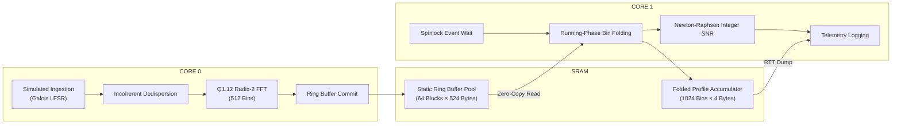

# System Architecture & Physics Design: PulsarSync-Core

PulsarSync-Core is a bare-metal dual-core real-time signal processing engine designed to detect the Vela Pulsar (PSR B0833-45) under strict CPU, memory, and power constraints. 

---

## 1. System Topology & Core Model

The RP2040 microcontroller contains two independent ARM Cortex-M0+ cores sharing 264 KB of SRAM. To guarantee zero CPU stalls and prevent missing sample frames, the workload is divided based on timing profiles:

### Core 0 (DSP and Ingestion Engine)
* **Frequency**: 133 MHz.
* **Role**: Handles synchronous, high-rate operations. It runs a deterministic loop that simulates an ADC stream (producing 512-byte blocks at 250 kHz), applies frequency-dependent dispersion delay shifts, executes a 512-point Cooley-Tukey FFT to resolve spectral channels, and pushes the data into the ring buffer.

### Core 1 (Folding and Scientific Integration Engine)
* **Frequency**: 133 MHz.
* **Role**: Handles asynchronous integration. It spins on the lock-free ring buffer tail index, reads completed blocks, integrates them into the 1024-bin rotational phase folding accumulator, calculates the Signal-to-Noise Ratio (SNR), and streams telemetry over RTT.

---

## 2. Zero-Copy Lock-Free Ring Buffer

To pass data frames between Core 0 and Core 1 without incurring memory copies (memcpy costs hundreds of clock cycles) or using thread-blocking mutexes, we implement a static Single-Producer Single-Consumer (SPSC) ring buffer.

### Memory Layout & Alignment
* The buffer pool is allocated in the BSS segment at boot as a static array:
  `static mut BLOCK_POOL: [SampleBlock; 64]`
* Each `SampleBlock` is annotated with `#[repr(C, align(4))]`. This forces the compiler to align the start of each block on a 32-bit address boundary. Without this, performing 32-bit word loads (`LDR` instructions) on a Cortex-M0+ causes a hardware `HardFault`.
* The ring buffer coordinates reads/writes using two atomic pointers: `head` (updated by consumer Core 1) and `tail` (updated by producer Core 0).

### Memory Barrier Contracts
* **Producer Store**: Core 0 writes data directly into `BLOCK_POOL[tail]` and executes:
  `self.tail.store(tail + 1, Ordering::Release)`
  This acts as a memory barrier, ensuring that all writes to the sample block are committed to RAM before the tail pointer advances.
* **Consumer Load**: Core 1 reads `tail` using:
  `self.tail.load(Ordering::Acquire)`
  This guarantees that Core 1 cannot read any slot until the Release store on Core 0 has completed, preventing cache/instruction out-of-order race conditions.

---

## 3. Fixed-Point DSP Pipeline

Because the Cortex-M0+ has no floating-point unit (FPU), all mathematical operations are implemented in integer fixed-point representations.

### Q16.16 Incoherent Dedispersion
* The interstellar medium acts as a dispersed plasma. Lower frequency channels travel slower. The max delay between the 400 MHz (highest) and 300 MHz (lowest) channels is ~1371.7 ms, which translates to 342,925 samples at our 250 kHz sample rate.
* At boot, we compute the sample delay for each of the 64 channels. To maintain precision, we perform calculations in Q16.16:
  `delay_ms_q16 = (K_Q16 * DM_Q16 * delta_inv_f2) >> 48`
* The delays are stored in a static lookup table. During runtime, Core 0 applies the delays by shifting indices in the sample ring.

### Q1.12 Cooley-Tukey Radix-2 FFT
* We convert the time-domain signal into the frequency domain using a 512-point Cooley-Tukey FFT.
* Real and imaginary values are represented as signed 16-bit integers (`i16`) scaled by 2^12 (4096).
* **CORDIC Twiddle Factors**: The twiddle factor table is generated at boot using a 12-iteration CORDIC shift-and-add algorithm. This calculates cos/sin values using only bit-shifts and additions, completely eliminating the need for trigonometry libraries.
* **Butterfly Saturation**: To prevent mathematical overflow from corrupting our signals into random noise, each butterfly operation clamps outputs to safe boundaries:
  `self.re = out_a_re.clamp(i16::MIN, i16::MAX)`

---

## 4. Phase Folding & Integer SNR

### Running-Phase Accumulator
* Modulo division operations (e.g., `tick % period`) are slow on the Cortex-M0+ because it lacks hardware division.
* We implement a modulo-free running-phase accumulator:
  `current_phase += 1; if current_phase >= period { current_phase -= period; }`
  This executes in 3 clock cycles instead of ~40 cycles, saving millions of instructions.

### Integer Standard Deviation (Newton-Raphson)
* SNR is calculated using:
  `SNR = (Peak - Mean) / StdDev`
* The standard deviation requires a square root of the profile variance. We compute this using the integer Newton-Raphson method:
  `x_(n+1) = 0.5 * (x_n + S / x_n)`
  This converges within 6–8 iterations, executing in only a few dozen clock cycles.
